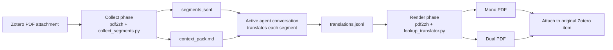
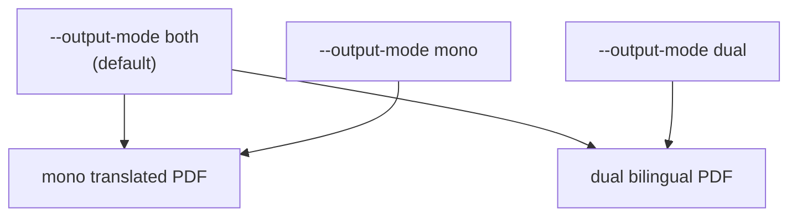

<p align="center">
  
</p>

<p align="center">
  <a href="./LICENSE"></a>
  
  
  
</p>

# Zotero Translate Skill

Translate Zotero PDF attachments into Chinese while preserving the original PDF layout. This skill combines the segmentation and rendering strengths of `pdf2zh` / BabelDOC with a **current-chat translation loop**: the active agent conversation translates the extracted text segments, then the skill renders mono and dual PDFs and attaches them back to Zotero.

It is designed for academic papers, technical reports, and long PDF workflows where layout, formulas, citations, and rich-text placeholders need to survive translation.

> This project is a Codex skill repository. The installable skill lives in [`skills/zotero-translate`](./skills/zotero-translate).

## Highlights

- **Current-chat translation only** - no provider key, no external translation service, no background LLM process.
- **Layout-preserving PDF rendering** - delegates segmentation, formula/layout preservation, and PDF generation to `pdf2zh-next` / BabelDOC.
- **Zotero-first workflow** - collect from a Zotero PDF attachment, render final PDFs, and attach the outputs under the original Zotero parent item.
- **Cross-platform scripts** - Python entrypoints work on Windows, macOS, and Linux; PowerShell wrappers remain for Windows users.
- **Mono, dual, or both** - defaults to both Chinese-only and bilingual PDFs.
- **Privacy-aware context packs** - generated context avoids local paths and personal storage details by default.
- **Manifest-based cleanup** - temporary run directories are removed only after attachment is confirmed.

## How It Works



The collection pass uses a CLI translator that returns the original source text while recording every actual segment in `segments.jsonl`. The active conversation then writes `translations.jsonl`. The render pass uses a lookup translator that maps each source segment hash to its translated text.

## Installation

### Option 1: Install with the Skills CLI

If your agent environment supports the Skills CLI, install directly from GitHub:

```bash
npx skills add https://github.com/Chael-Chael/zotero-translate-skill
```

After installation, restart your agent client so it reloads available skills.

### Option 2: Manual install for Codex

Clone the repository and copy the skill folder into your Codex skill directory.

macOS / Linux:

```bash
git clone https://github.com/Chael-Chael/zotero-translate-skill.git
mkdir -p "${CODEX_HOME:-$HOME/.codex}/skills"
cp -R zotero-translate-skill/skills/zotero-translate "${CODEX_HOME:-$HOME/.codex}/skills/zotero-translate"
```

Windows PowerShell:

```powershell
git clone https://github.com/Chael-Chael/zotero-translate-skill.git
New-Item -ItemType Directory -Force "$env:USERPROFILE\.codex\skills" | Out-Null
Copy-Item -Recurse -Force ".\zotero-translate-skill\skills\zotero-translate" "$env:USERPROFILE\.codex\skills\zotero-translate"
```

Restart Codex after copying the skill.

### Option 3: Manual install for other agents

Copy [`skills/zotero-translate`](./skills/zotero-translate) into the skill directory used by your agent, or point the agent at its `SKILL.md` file. The deterministic workflow scripts are Python-based and portable, but Zotero attachment requires your agent to have a Zotero Desktop connector or equivalent local Zotero automation tool.

## Requirements

| Requirement | Why it is needed |
| --- | --- |
| Python 3.10+ | Creates the skill-local virtual environment and runs helper scripts. |
| Zotero Desktop | Source PDFs and final attachments live in Zotero. |
| Zotero-capable agent connector | Needed to read the selected item and attach final PDFs. |
| Internet on first runtime setup | Installs `pdf2zh-next` and `PyMuPDF` into the skill-local venv. |
| Current chat with enough context budget | The active conversation translates `segments.jsonl`. |

The first runtime setup creates:

```text
skills/zotero-translate/.runtime/venv
~/.cache/babeldoc
```

These are intentionally excluded from version control.

## Quick Start

Ask your agent:

```text
Use $zotero-translate to translate the selected Zotero PDF.
```

By default, the skill:

1. Translates the full PDF.
2. Produces both mono and dual PDFs.
3. Uses no watermark.
4. Attaches all final PDFs to the same Zotero parent item.
5. Cleans intermediate run artifacts after Zotero attachment is verified.

## Prompt Controls

| User request | Skill behavior |
| --- | --- |
| "translate this Zotero PDF" | Full PDF, mono + dual output. |
| "pages 1-3 only" | Passes `--pages "1-3"` to pdf2zh. |
| "mono only" / "Chinese-only" | Uses `--output-mode mono`. |
| "dual only" / "bilingual" | Uses `--output-mode dual`. |
| "keep artifacts" | Skips cleanup for debugging. |

## Direct CLI Usage

You normally invoke the skill through an agent, but the deterministic phases can also be run directly.

Collect segments:

```bash
python skills/zotero-translate/scripts/run_pdf2zh.py \
  --input-pdf "/path/to/paper.pdf"
```

Collect only selected pages and request mono output:

```bash
python skills/zotero-translate/scripts/run_pdf2zh.py \
  --input-pdf "/path/to/paper.pdf" \
  --pages "1-3" \
  --output-mode mono
```

After the active conversation writes `translations.jsonl`, render final PDFs:

```bash
python skills/zotero-translate/scripts/run_pdf2zh.py \
  --phase render \
  --run-dir "/tmp/zotero-translate-runs/<run-id>"
```

Clean a verified run:

```bash
python skills/zotero-translate/scripts/cleanup_artifacts.py \
  --run-dir "/tmp/zotero-translate-runs/<run-id>" \
  --confirm-attached
```

PowerShell wrappers with equivalent parameters are also available under [`scripts/`](./skills/zotero-translate/scripts).

## Generated Artifacts

Each run creates a managed directory under the platform temp folder:

```text
zotero-translate-runs/<pdf-stem>-<hash>-<timestamp>/
├── run_manifest.json
├── context_pack.md
├── segments.jsonl
├── translations.jsonl
├── missing_segments.jsonl
├── collect-output/
├── render-output/
└── tmp/
```

Temporary run directories can be deleted after successful Zotero attachment. Do not delete the skill-local `.runtime/venv` or the BabelDOC cache unless you want the next run to reinstall assets.

## Output Modes



The default is intentionally generous for Zotero workflows: attach both outputs once, then keep whichever one is more useful for reading.

## Privacy Model

The skill does not send a paper to a separate translation API. Translation happens in the active agent conversation that is already handling your request. The context pack redacts common local path fields by default and keeps only bounded paper context such as metadata and early-page text.

Important boundaries:

- Zotero item metadata and extracted PDF segments are visible to the active conversation.
- The skill does not require provider-specific translation credentials.
- Local run directories may contain source and translated text until cleanup is complete.

## Troubleshooting

| Symptom | What to check |
| --- | --- |
| `No usable Python 3 executable was found` | Install Python 3.10+ or pass `--python-exe /path/to/python`. |
| Runtime setup is slow | First run installs `pdf2zh-next`, `PyMuPDF`, fonts, and BabelDOC assets. |
| Render reports missing segments | Open `missing_segments.jsonl`, translate the listed ids, append to `translations.jsonl`, and rerun render. |
| Zotero attachment fails | Confirm Zotero Desktop is open and your agent has a working Zotero connector. |
| Disk usage grows | Clean completed run directories; keep `.runtime/venv` and `~/.cache/babeldoc` for faster future runs. |

## Repository Layout

```text
.
├── README.md
├── LICENSE
├── assets/
│   └── zotero-translate-banner.svg
└── skills/
    └── zotero-translate/
        ├── SKILL.md
        ├── agents/
        ├── references/
        └── scripts/
```

## Acknowledgements

This skill is inspired by the PDF layout-preserving workflow of [PDFMathTranslate / PDFMathTranslate](https://github.com/PDFMathTranslate/PDFMathTranslate) and its `pdf2zh` / BabelDOC ecosystem. The README structure takes cues from public skills repositories such as [greensock/gsap-skills](https://github.com/greensock/gsap-skills) and [kepano/obsidian-skills](https://github.com/kepano/obsidian-skills).

This repository is not affiliated with Zotero, PDFMathTranslate, BabelDOC, Greensock, or Obsidian.

## License

AGPL-3.0. See [`LICENSE`](./LICENSE).
