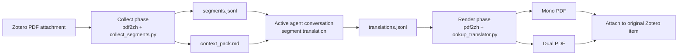
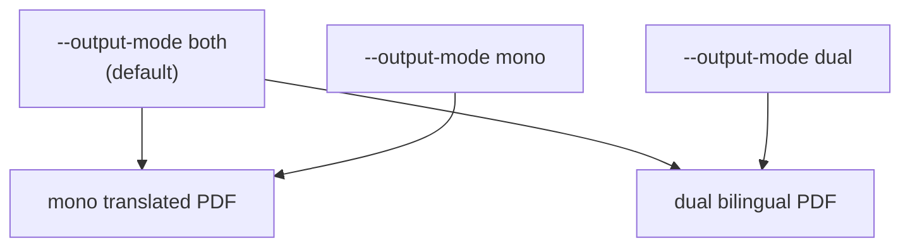

<p align="center">
  
</p>

<p align="center">
  <a href="../LICENSE"></a>
  
  
  
</p>

[English](../README.md) | [简体中文](README_zh-CN.md) | [繁體中文](README_zh-TR.md) | 日本語 | [한국어](README_ko-KR.md)

# Zotero Translate Skill

Zotero の PDF 添付ファイルをユーザー指定の target language へ翻訳しながら、元の PDF レイアウトをできるだけ維持する skill です。この skill は Codex だけでなく、ローカル skills を読み込める任意の agent で使えます。`pdf2zh` / BabelDOC の分割・レンダリング機能と、**現在のチャットで行う翻訳ループ**を組み合わせています。現在の agent 会話が抽出されたテキストセグメントを翻訳し、この skill が mono / dual PDF をレンダリングして Zotero に添付します。

大きな利点はセットアップの軽さです。Zotero 翻訳 plugin をインストールしたり、PDF 翻訳環境を手作業で設定したり、`pdf2zh` / BabelDOC を事前に準備したりする必要はありません。skill をインストールすると、初回実行時にローカル runtime を自動で準備します。

学術論文、技術レポート、長い PDF ワークフローに向いています。特に、数式、引用、プレースホルダー、リッチテキストタグを保護したい場合に便利です。

> これは agent skill リポジトリです。インストール対象の skill は [`skills/zotero-translate`](../skills/zotero-translate) にあります。

## 主な特徴

- **現在のチャットだけで翻訳**：provider key は不要。外部翻訳サービスやバックグラウンド LLM プロセスを使いません。
- **PDF レイアウトを維持**：分割、数式/レイアウト保護、PDF 生成は `pdf2zh-next` / BabelDOC に委譲します。
- **Zotero plugin 不要**：agent の Zotero connector から Zotero Desktop を使います。別の Zotero 翻訳 plugin は不要です。
- **手動環境設定不要**：skill は初回実行時にローカル venv と必要な runtime を準備します。
- **Zotero 中心の workflow**：Zotero の PDF 添付から収集し、最終 PDF をレンダリングして元の Zotero item に添付します。
- **クロスプラットフォーム**：Python entrypoint は Windows、macOS、Linux に対応。Windows 向け PowerShell wrapper もあります。
- **target language is required**：ユーザーが翻訳先言語を指定していない場合、agent は実行前に確認します。
- **mono、dual、both**：既定では target-language PDF と bilingual PDF の両方を生成します。
- **privacy-aware context pack**：既定ではローカルパスや個人ストレージ情報を書き込みません。
- **manifest-based cleanup**：Zotero への添付を確認してから一時実行ディレクトリを削除します。

## 仕組み



collect phase では CLI translator が原文をそのまま pdf2zh に返しつつ、実際のセグメントを `segments.jsonl` に記録します。現在の会話が `context_pack.md` と `segments.jsonl` を読み、`translations.jsonl` を書きます。render phase では安定した hash によって訳文を検索し、最終 PDF を生成します。

## インストール

### Option 1: Skills CLI

agent 環境が Skills CLI をサポートしている場合、GitHub から直接インストールできます。

```bash
npx skills add https://github.com/Chael-Chael/zotero-translate-skill
```

インストール後、agent client を再起動して skills を再読み込みしてください。

### Option 2: Codex への手動インストール

リポジトリを clone し、skill フォルダを Codex skill directory にコピーします。

macOS / Linux:

```bash
git clone https://github.com/Chael-Chael/zotero-translate-skill.git
mkdir -p "${CODEX_HOME:-$HOME/.codex}/skills"
cp -R zotero-translate-skill/skills/zotero-translate "${CODEX_HOME:-$HOME/.codex}/skills/zotero-translate"
```

Windows PowerShell:

```powershell
git clone https://github.com/Chael-Chael/zotero-translate-skill.git
New-Item -ItemType Directory -Force "$env:USERPROFILE\.codex\skills" | Out-Null
Copy-Item -Recurse -Force ".\zotero-translate-skill\skills\zotero-translate" "$env:USERPROFILE\.codex\skills\zotero-translate"
```

コピー後、Codex を再起動してください。

Codex は一般的な local skill directory を持つため例として示しています。この workflow 自体は Codex 専用ではありません。

### Option 3: 他の agent への手動インストール

[`skills/zotero-translate`](../skills/zotero-translate) を agent が使用する skill directory にコピーするか、agent に `SKILL.md` を参照させてください。決定的な workflow script は Python ベースで portable ですが、Zotero への添付には Zotero Desktop connector または同等のローカル Zotero automation が必要です。Zotero 翻訳 plugin は不要です。

## Requirements

| Requirement | Purpose |
| --- | --- |
| Python 3.10+ | skill-local virtual environment を作成し、helper scripts を実行します。 |
| Zotero Desktop | PDF source と final attachments は Zotero にあります。 |
| Zotero-capable agent connector | 選択 item の読み取りと final PDF の添付に必要です。 |
| 初回セットアップ時のネットワーク | `pdf2zh-next` と `PyMuPDF` をインストールします。 |
| 十分な current chat context | 現在の会話が `segments.jsonl` を翻訳します。 |

初回実行時に作成されるもの：

```text
skills/zotero-translate/.runtime/venv
~/.cache/babeldoc
```

これらは version control から除外されています。

`pdf2zh`、BabelDOC、Zotero 翻訳 plugin を事前にインストールする必要はありません。skill が自分の directory の下で runtime を準備します。

## Quick Start

agent に次のように依頼します。

```text
Use $zotero-translate to translate the selected Zotero PDF into Japanese.
```

既定の動作：

1. PDF 全体をユーザー指定の target language へ翻訳します。
2. mono と dual PDF の両方を生成します。
3. watermark は付けません。
4. final PDFs を同じ Zotero parent item に添付します。
5. Zotero attachment を確認した後、中間実行 artifacts を削除します。

prompt に target language が含まれていない場合、agent は collect phase を実行する前に翻訳先言語を質問します。

## Prompt Controls

| User request | Skill behavior |
| --- | --- |
| "translate this Zotero PDF into Spanish" | Full PDF、mono + dual output。 |
| "translate this Zotero PDF" | target language を確認してから実行します。 |
| "pages 1-3 only" | `--pages "1-3"` を渡します。 |
| "mono only" / "target-language-only" | `--output-mode mono` を使います。 |
| "dual only" / "bilingual" | `--output-mode dual` を使います。 |
| "keep artifacts" | debugging 用に temporary artifacts を保持します。 |

## Direct CLI Usage

通常は agent 経由で skill を呼び出しますが、決定的な各 phase は直接実行できます。

Collect segments:

```bash
python skills/zotero-translate/scripts/run_pdf2zh.py \
  --input-pdf "/path/to/paper.pdf" \
  --lang-out "ja"
```

指定ページのみを collect し、mono output を指定する場合：

```bash
python skills/zotero-translate/scripts/run_pdf2zh.py \
  --input-pdf "/path/to/paper.pdf" \
  --lang-out "ja" \
  --pages "1-3" \
  --output-mode mono
```

現在の会話が `translations.jsonl` を書いた後、final PDFs を render：

```bash
python skills/zotero-translate/scripts/run_pdf2zh.py \
  --phase render \
  --run-dir "/tmp/zotero-translate-runs/<run-id>"
```

Zotero attachment を確認した後に cleanup：

```bash
python skills/zotero-translate/scripts/cleanup_artifacts.py \
  --run-dir "/tmp/zotero-translate-runs/<run-id>" \
  --confirm-attached
```

Windows では [`scripts/`](../skills/zotero-translate/scripts) の PowerShell wrapper も使えます。

## Generated Artifacts

各 run は platform temp folder の下に作成されます。

```text
zotero-translate-runs/<pdf-stem>-<hash>-<timestamp>/
├── run_manifest.json
├── context_pack.md
├── segments.jsonl
├── translations.jsonl
├── missing_segments.jsonl
├── collect-output/
├── render-output/
└── tmp/
```

Zotero への添付が成功したら temporary run directory は削除できます。次回の実行を速くするため、skill-local `.runtime/venv` と BabelDOC cache は残しておくことを推奨します。

## Output Modes



既定では Zotero workflow 向けに両方を生成します。あとで読みやすい方を選べます。

## Privacy Model

この skill は論文を別の翻訳サービスへ送信しません。翻訳は、すでにリクエストを処理している現在の agent 会話内で行われます。context pack は既定で一般的なローカルパスを redaction し、bounded な metadata と冒頭ページの text のみを保持します。

Boundaries:

- Zotero item metadata と抽出された PDF segments は現在の会話に表示されます。
- provider-specific translation credentials は不要です。
- cleanup が終わるまで、local run directories に source text と translated text が残る場合があります。

## Troubleshooting

| Symptom | What to check |
| --- | --- |
| `No usable Python 3 executable was found` | Python 3.10+ をインストールするか、`--python-exe /path/to/python` を渡してください。 |
| 初回実行が遅い | 初回は `pdf2zh-next`、`PyMuPDF`、fonts、BabelDOC assets をインストールします。 |
| Render reports missing segments | `missing_segments.jsonl` を開き、対象 id を翻訳して `translations.jsonl` に追記し、render を再実行してください。 |
| Zotero attachment fails | Zotero Desktop が起動しており、agent が Zotero connector を使えることを確認してください。 |
| Disk usage grows | 完了した run directories を cleanup してください。`.runtime/venv` と `~/.cache/babeldoc` は保持すると次回が速くなります。 |

## Repository Layout

```text
.
├── README.md
├── docs/
├── LICENSE
├── assets/
│   └── zotero-translate-banner.svg
└── skills/
    └── zotero-translate/
        ├── SKILL.md
        ├── agents/
        ├── references/
        └── scripts/
```

## Acknowledgements

この skill は [PDFMathTranslate / PDFMathTranslate](https://github.com/PDFMathTranslate/PDFMathTranslate) とその `pdf2zh` / BabelDOC ecosystem から着想を得ています。README structure は [greensock/gsap-skills](https://github.com/greensock/gsap-skills) と [kepano/obsidian-skills](https://github.com/kepano/obsidian-skills) などの公開 skills repositories を参考にしています。

This repository is not affiliated with Zotero, PDFMathTranslate, BabelDOC, Greensock, or Obsidian.

## License

AGPL-3.0. See [`LICENSE`](../LICENSE).
