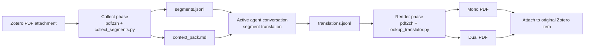
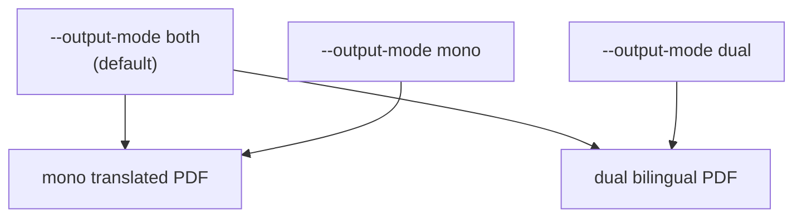

<p align="center">
  
</p>

<p align="center">
  <a href="../LICENSE"></a>
  
  
  
</p>

[English](../README.md) | [简体中文](README_zh-CN.md) | [繁體中文](README_zh-TW.md) | [日本語](README_ja-JP.md) | 한국어

# Zotero Translate Skill

Zotero PDF 첨부 파일을 사용자가 지정한 target language로 번역하면서 원본 PDF 레이아웃을 최대한 유지하는 skill입니다. 이 skill은 Codex에만 국한되지 않으며, 로컬 skills를 로드할 수 있는 모든 agent에서 사용할 수 있습니다. `pdf2zh` / BabelDOC의 분할 및 렌더링 기능과 **현재 채팅 번역 루프**를 결합합니다. 활성 agent 대화가 추출된 텍스트 세그먼트를 번역하고, skill이 mono / dual PDF를 렌더링한 뒤 Zotero에 다시 첨부합니다.

핵심 장점은 간단한 설치입니다. Zotero 번역 plugin을 설치하거나, PDF 번역 환경을 수동으로 구성하거나, `pdf2zh` / BabelDOC를 미리 준비할 필요가 없습니다. skill을 설치하면 첫 실행 시 로컬 runtime을 자동으로 준비합니다.

학술 논문, 기술 보고서, 긴 PDF 워크플로에 적합하며, 수식, 인용, placeholder, rich-text tag를 보존해야 하는 경우에 특히 유용합니다.

> 이 저장소는 agent skill 저장소입니다. 설치 가능한 skill은 [`skills/zotero-translate`](../skills/zotero-translate)에 있습니다.

## 주요 기능

- **현재 채팅에서만 번역**: provider key가 필요 없고, 외부 번역 서비스나 백그라운드 LLM 프로세스를 사용하지 않습니다.
- **PDF 레이아웃 보존**: 분할, 수식/레이아웃 보호, PDF 생성은 `pdf2zh-next` / BabelDOC에 맡깁니다.
- **Zotero plugin 불필요**: agent의 Zotero connector를 통해 Zotero Desktop을 사용합니다. 별도의 Zotero 번역 plugin은 필요하지 않습니다.
- **수동 환경 구성 불필요**: skill은 첫 실행 시 로컬 venv와 필요한 runtime을 준비합니다.
- **Zotero 중심 workflow**: Zotero PDF 첨부 파일에서 세그먼트를 수집하고, 최종 PDF를 렌더링한 뒤 원래 Zotero item에 첨부합니다.
- **크로스 플랫폼 스크립트**: Python entrypoint는 Windows, macOS, Linux에서 동작합니다. Windows 사용자를 위한 PowerShell wrapper도 제공합니다.
- **target language is required**: 사용자가 번역할 언어를 지정하지 않았다면 agent는 실행 전에 target language를 질문해야 합니다.
- **mono, dual, both**: 기본값은 target-language PDF와 bilingual PDF를 모두 생성합니다.
- **privacy-aware context pack**: 기본적으로 로컬 경로와 개인 저장소 정보를 기록하지 않습니다.
- **manifest 기반 cleanup**: Zotero 첨부가 확인된 뒤에만 임시 run directory를 정리합니다.

## 동작 방식



collect phase에서는 CLI translator가 원문을 그대로 pdf2zh에 반환하면서 실제 세그먼트를 `segments.jsonl`에 기록합니다. 활성 대화는 `context_pack.md`와 `segments.jsonl`을 읽고 `translations.jsonl`을 작성합니다. render phase에서는 안정적인 hash로 번역문을 찾아 최종 PDF를 생성합니다.

## 설치

### Option 1: Skills CLI

agent 환경이 Skills CLI를 지원한다면 GitHub에서 바로 설치할 수 있습니다.

```bash
npx skills add https://github.com/Chael-Chael/zotero-translate-skill
```

설치 후 agent client를 재시작하여 skills를 다시 로드하세요.

### Option 2: Codex 수동 설치

저장소를 clone하고 skill 폴더를 Codex skill directory로 복사합니다.

macOS / Linux:

```bash
git clone https://github.com/Chael-Chael/zotero-translate-skill.git
mkdir -p "${CODEX_HOME:-$HOME/.codex}/skills"
cp -R zotero-translate-skill/skills/zotero-translate "${CODEX_HOME:-$HOME/.codex}/skills/zotero-translate"
```

Windows PowerShell:

```powershell
git clone https://github.com/Chael-Chael/zotero-translate-skill.git
New-Item -ItemType Directory -Force "$env:USERPROFILE\.codex\skills" | Out-Null
Copy-Item -Recurse -Force ".\zotero-translate-skill\skills\zotero-translate" "$env:USERPROFILE\.codex\skills\zotero-translate"
```

복사 후 Codex를 재시작하세요.

Codex는 일반적인 local skill directory가 있어 예시로 표시했습니다. 이 workflow 자체는 Codex 전용이 아닙니다.

### Option 3: 다른 agent에 수동 설치

[`skills/zotero-translate`](../skills/zotero-translate)를 agent가 사용하는 skill directory에 복사하거나, agent가 `SKILL.md`를 직접 참조하게 하세요. deterministic workflow scripts는 Python 기반이며 portable합니다. 다만 Zotero 첨부에는 Zotero Desktop connector 또는 동등한 로컬 Zotero automation 도구가 필요합니다. Zotero 번역 plugin은 필요하지 않습니다.

## 요구 사항

| Requirement | Purpose |
| --- | --- |
| Python 3.10+ | skill-local virtual environment를 만들고 helper scripts를 실행합니다. |
| Zotero Desktop | PDF source와 final attachments가 Zotero에 있습니다. |
| Zotero-capable agent connector | 선택한 item을 읽고 final PDF를 첨부하는 데 필요합니다. |
| 첫 runtime setup 시 네트워크 | `pdf2zh-next`와 `PyMuPDF`를 설치합니다. |
| 충분한 current chat context | 활성 대화가 `segments.jsonl`을 번역합니다. |

첫 실행 시 생성되는 항목:

```text
skills/zotero-translate/.runtime/venv
~/.cache/babeldoc
```

이 디렉터리들은 version control에서 제외됩니다.

`pdf2zh`, BabelDOC, Zotero 번역 plugin을 미리 설치할 필요는 없습니다. skill이 자체 directory 아래에 runtime을 준비합니다.

## Quick Start

agent에게 다음처럼 요청하세요.

```text
Use $zotero-translate to translate the selected Zotero PDF into Japanese.
```

기본 동작:

1. 전체 PDF를 사용자가 지정한 target language로 번역합니다.
2. mono와 dual PDF를 모두 생성합니다.
3. watermark를 넣지 않습니다.
4. final PDFs를 같은 Zotero parent item에 첨부합니다.
5. Zotero attachment를 확인한 뒤 중간 run artifacts를 정리합니다.

prompt에 target language가 없으면 agent는 collect phase를 실행하기 전에 어떤 언어로 번역할지 질문해야 합니다.

## Prompt Controls

| User request | Skill behavior |
| --- | --- |
| "translate this Zotero PDF" | Full PDF, mono + dual output. |
| "pages 1-3 only" | `--pages "1-3"`를 전달합니다. |
| "mono only" / "Chinese-only" | `--output-mode mono`를 사용합니다. |
| "dual only" / "bilingual" | `--output-mode dual`을 사용합니다. |
| "keep artifacts" | debugging을 위해 temporary artifacts를 보존합니다. |

## Direct CLI Usage

일반적으로는 agent를 통해 skill을 호출하지만, deterministic phases는 직접 실행할 수도 있습니다.

Collect segments:

```bash
python skills/zotero-translate/scripts/run_pdf2zh.py \
  --input-pdf "/path/to/paper.pdf"
```

일부 페이지만 collect하고 mono output을 지정:

```bash
python skills/zotero-translate/scripts/run_pdf2zh.py \
  --input-pdf "/path/to/paper.pdf" \
  --pages "1-3" \
  --output-mode mono
```

활성 대화가 `translations.jsonl`을 작성한 뒤 final PDFs 렌더링:

```bash
python skills/zotero-translate/scripts/run_pdf2zh.py \
  --phase render \
  --run-dir "/tmp/zotero-translate-runs/<run-id>"
```

Zotero attachment를 확인한 뒤 cleanup:

```bash
python skills/zotero-translate/scripts/cleanup_artifacts.py \
  --run-dir "/tmp/zotero-translate-runs/<run-id>" \
  --confirm-attached
```

Windows에서는 [`scripts/`](../skills/zotero-translate/scripts)의 PowerShell wrapper도 사용할 수 있습니다.

## Generated Artifacts

각 run은 platform temp folder 아래에 생성됩니다.

```text
zotero-translate-runs/<pdf-stem>-<hash>-<timestamp>/
├── run_manifest.json
├── context_pack.md
├── segments.jsonl
├── translations.jsonl
├── missing_segments.jsonl
├── collect-output/
├── render-output/
└── tmp/
```

Zotero 첨부가 성공하면 temporary run directory를 삭제할 수 있습니다. 다음 실행을 빠르게 하려면 skill-local `.runtime/venv`와 BabelDOC cache는 유지하는 것이 좋습니다.

## Output Modes



기본값은 Zotero workflow에 맞게 두 출력물을 모두 생성합니다. 이후 읽기 편한 버전을 선택하면 됩니다.

## Privacy Model

이 skill은 논문을 별도의 번역 서비스로 보내지 않습니다. 번역은 이미 요청을 처리하고 있는 활성 agent 대화 안에서 이루어집니다. context pack은 기본적으로 일반적인 로컬 경로를 redact하고 제한된 metadata와 앞부분 페이지 텍스트만 유지합니다.

Boundaries:

- Zotero item metadata와 추출된 PDF segments는 활성 대화에 표시됩니다.
- provider-specific translation credentials는 필요하지 않습니다.
- cleanup 전까지 local run directories에 source text와 translated text가 남아 있을 수 있습니다.

## Troubleshooting

| Symptom | What to check |
| --- | --- |
| `No usable Python 3 executable was found` | Python 3.10+를 설치하거나 `--python-exe /path/to/python`을 전달하세요. |
| 첫 실행이 느림 | 첫 실행에서는 `pdf2zh-next`, `PyMuPDF`, fonts, BabelDOC assets를 설치합니다. |
| Render reports missing segments | `missing_segments.jsonl`을 열고 해당 id를 번역한 뒤 `translations.jsonl`에 추가하고 render를 다시 실행하세요. |
| Zotero attachment fails | Zotero Desktop이 실행 중이고 agent가 Zotero connector를 사용할 수 있는지 확인하세요. |
| Disk usage grows | 완료된 run directories를 cleanup하세요. `.runtime/venv`와 `~/.cache/babeldoc`를 유지하면 다음 실행이 더 빠릅니다. |

## Repository Layout

```text
.
├── README.md
├── docs/
├── LICENSE
├── assets/
│   └── zotero-translate-banner.svg
└── skills/
    └── zotero-translate/
        ├── SKILL.md
        ├── agents/
        ├── references/
        └── scripts/
```

## Acknowledgements

이 skill은 [PDFMathTranslate / PDFMathTranslate](https://github.com/PDFMathTranslate/PDFMathTranslate)와 그 `pdf2zh` / BabelDOC ecosystem에서 영감을 받았습니다. README structure는 [greensock/gsap-skills](https://github.com/greensock/gsap-skills), [kepano/obsidian-skills](https://github.com/kepano/obsidian-skills) 같은 공개 skills repositories를 참고했습니다.

This repository is not affiliated with Zotero, PDFMathTranslate, BabelDOC, Greensock, or Obsidian.

## License

AGPL-3.0. See [`LICENSE`](../LICENSE).
