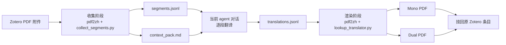
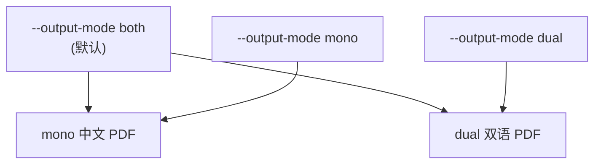

<p align="center">
  
</p>

<p align="center">
  <a href="../LICENSE"></a>
  
  
  
</p>

[English](../README.md) | 简体中文 | [繁體中文](README_zh-TW.md) | [日本語](README_ja-JP.md) | [한국어](README_ko-KR.md)

# Zotero Translate Skill

将 Zotero PDF 附件翻译成中文，同时尽量保留原 PDF 的排版。这个 skill 适用于任何支持本地 skills 的 agent，不限于 Codex。它结合了 `pdf2zh` / BabelDOC 的分段与渲染能力，以及 **当前对话翻译循环**：当前 agent 对话负责翻译抽取出的文本片段，skill 再渲染 mono / dual PDF，并把结果挂回 Zotero。

核心价值是安装简单：不需要安装 Zotero 翻译插件，不需要手工配置 PDF 翻译环境，也不需要预先配置 `pdf2zh` / BabelDOC。安装 skill 后，它会在首次运行时自举本地运行时。

它适合学术论文、技术报告和长 PDF 工作流，尤其适合需要保护公式、引用、占位符和富文本标签的场景。

> 这是一个 agent skill 仓库。可安装的 skill 位于 [`skills/zotero-translate`](../skills/zotero-translate)。

## 特性

- **只使用当前对话翻译**：不需要 provider key，不调用外部翻译服务，不启动后台 LLM 进程。
- **保留 PDF 排版**：分段、公式/版式保护和 PDF 生成交给 `pdf2zh-next` / BabelDOC。
- **无需 Zotero 插件**：通过 agent 的 Zotero connector 使用 Zotero Desktop，不需要额外安装 Zotero 翻译插件。
- **无需手工配置环境**：skill 首次运行会创建本地 venv 并安装所需运行时。
- **Zotero 优先**：从 Zotero PDF 附件收集文本，渲染最终 PDF，并挂回原 Zotero 条目。
- **跨平台脚本**：Python 主入口支持 Windows、macOS、Linux；Windows 用户仍可使用 PowerShell wrapper。
- **mono、dual 或 both**：默认同时生成中文译文 PDF 和双语 PDF。
- **隐私友好的上下文包**：默认不写入本地路径和个人存储细节。
- **基于 manifest 的清理**：只有确认 Zotero 附件已写回后，才清理临时运行目录。

## 工作原理



收集阶段使用一个 CLI translator：它把原文直接返回给 pdf2zh，同时把每个真实分段写入 `segments.jsonl`。当前对话读取 `context_pack.md` 和 `segments.jsonl`，写入 `translations.jsonl`。渲染阶段再按稳定 hash 查找译文并生成最终 PDF。

## 安装

### 方式 1：使用 Skills CLI

如果你的 agent 环境支持 Skills CLI，可以直接从 GitHub 安装：

```bash
npx skills add https://github.com/Chael-Chael/zotero-translate-skill
```

安装后重启 agent 客户端，让它重新加载 skills。

### 方式 2：Codex 手动安装

克隆仓库，并把 skill 目录复制到 Codex skills 目录。

macOS / Linux：

```bash
git clone https://github.com/Chael-Chael/zotero-translate-skill.git
mkdir -p "${CODEX_HOME:-$HOME/.codex}/skills"
cp -R zotero-translate-skill/skills/zotero-translate "${CODEX_HOME:-$HOME/.codex}/skills/zotero-translate"
```

Windows PowerShell：

```powershell
git clone https://github.com/Chael-Chael/zotero-translate-skill.git
New-Item -ItemType Directory -Force "$env:USERPROFILE\.codex\skills" | Out-Null
Copy-Item -Recurse -Force ".\zotero-translate-skill\skills\zotero-translate" "$env:USERPROFILE\.codex\skills\zotero-translate"
```

复制后重启 Codex。

这里列出 Codex 是因为它有常见的本地 skill 目录；workflow 本身并不绑定 Codex。

### 方式 3：其它 agent 手动安装

把 [`skills/zotero-translate`](../skills/zotero-translate) 复制到你的 agent 使用的 skill 目录，或让 agent 指向其中的 `SKILL.md`。确定性工作流脚本是 Python 跨平台实现；但 Zotero 写回需要你的 agent 具备 Zotero Desktop connector 或等价的本地 Zotero 自动化能力。不需要 Zotero 翻译插件。

## 依赖

| 依赖 | 用途 |
| --- | --- |
| Python 3.10+ | 创建 skill-local venv 并运行 helper scripts。 |
| Zotero Desktop | PDF 来源和最终附件都在 Zotero 中。 |
| 支持 Zotero 的 agent connector | 用于读取选中条目并写回最终 PDF。 |
| 首次运行可联网 | 安装 `pdf2zh-next` 和 `PyMuPDF`。 |
| 足够的当前对话上下文 | 当前对话需要翻译 `segments.jsonl`。 |

首次运行会创建：

```text
skills/zotero-translate/.runtime/venv
~/.cache/babeldoc
```

这些目录已被排除在版本控制之外。

你不需要预装 `pdf2zh`、BabelDOC 或 Zotero 翻译插件；skill 会在自己的目录下准备运行时。

## 快速开始

对你的 agent 说：

```text
Use $zotero-translate to translate the selected Zotero PDF.
```

默认行为：

1. 翻译整个 PDF。
2. 同时生成 mono 和 dual PDF。
3. 不添加水印。
4. 把最终 PDF 附加到同一个 Zotero parent item。
5. 验证 Zotero 附件后清理中间运行目录。

## Prompt 控制

| 用户请求 | skill 行为 |
| --- | --- |
| "translate this Zotero PDF" | 全文翻译，输出 mono + dual。 |
| "pages 1-3 only" | 传递 `--pages "1-3"`。 |
| "mono only" / "Chinese-only" | 使用 `--output-mode mono`。 |
| "dual only" / "bilingual" | 使用 `--output-mode dual`。 |
| "keep artifacts" | 保留临时产物用于调试。 |

## 直接使用 CLI

通常你会通过 agent 调用 skill，但确定性阶段也可以直接运行。

收集分段：

```bash
python skills/zotero-translate/scripts/run_pdf2zh.py \
  --input-pdf "/path/to/paper.pdf"
```

只收集部分页面并指定 mono：

```bash
python skills/zotero-translate/scripts/run_pdf2zh.py \
  --input-pdf "/path/to/paper.pdf" \
  --pages "1-3" \
  --output-mode mono
```

当前对话写好 `translations.jsonl` 后渲染：

```bash
python skills/zotero-translate/scripts/run_pdf2zh.py \
  --phase render \
  --run-dir "/tmp/zotero-translate-runs/<run-id>"
```

确认 Zotero 附件后清理：

```bash
python skills/zotero-translate/scripts/cleanup_artifacts.py \
  --run-dir "/tmp/zotero-translate-runs/<run-id>" \
  --confirm-attached
```

Windows 用户也可以使用 [`scripts/`](../skills/zotero-translate/scripts) 下的 PowerShell wrapper。

## 运行产物

每次运行会在系统临时目录下创建：

```text
zotero-translate-runs/<pdf-stem>-<hash>-<timestamp>/
├── run_manifest.json
├── context_pack.md
├── segments.jsonl
├── translations.jsonl
├── missing_segments.jsonl
├── collect-output/
├── render-output/
└── tmp/
```

确认 Zotero 写回成功后，可以删除临时运行目录。不要删除 skill-local `.runtime/venv` 或 BabelDOC cache，除非你希望下次重新安装运行时和资源。

## 输出模式



默认同时输出两种 PDF，便于 Zotero 中一次保存，再按阅读习惯选择使用。

## 隐私模型

skill 不会把论文发送给独立的翻译服务。翻译发生在正在处理你请求的当前 agent 对话中。上下文包默认会移除常见本地路径字段，只保留有限的论文元数据和前几页文本。

边界说明：

- Zotero 条目元数据和抽取出的 PDF 分段会进入当前对话。
- skill 不需要 provider-specific translation credentials。
- 清理完成前，本地 run 目录可能包含原文和译文。

## 故障排查

| 现象 | 检查项 |
| --- | --- |
| `No usable Python 3 executable was found` | 安装 Python 3.10+，或传入 `--python-exe /path/to/python`。 |
| 首次运行很慢 | 首次会安装 `pdf2zh-next`、`PyMuPDF`、字体和 BabelDOC 资源。 |
| render 提示缺失分段 | 打开 `missing_segments.jsonl`，翻译对应 id，追加到 `translations.jsonl` 后重跑 render。 |
| Zotero 附件失败 | 确认 Zotero Desktop 已打开，并且 agent 有可用的 Zotero connector。 |
| 磁盘占用增长 | 清理已完成的 run 目录；保留 `.runtime/venv` 和 `~/.cache/babeldoc` 可加快后续运行。 |

## 仓库结构

```text
.
├── README.md
├── docs/
├── LICENSE
├── assets/
│   └── zotero-translate-banner.svg
└── skills/
    └── zotero-translate/
        ├── SKILL.md
        ├── agents/
        ├── references/
        └── scripts/
```

## 致谢

这个 skill 受 [PDFMathTranslate / PDFMathTranslate](https://github.com/PDFMathTranslate/PDFMathTranslate) 及其 `pdf2zh` / BabelDOC 生态启发。README 结构参考了 [greensock/gsap-skills](https://github.com/greensock/gsap-skills) 和 [kepano/obsidian-skills](https://github.com/kepano/obsidian-skills) 等公开 skills 仓库。

本仓库与 Zotero、PDFMathTranslate、BabelDOC、Greensock 或 Obsidian 没有关联。

## 许可证

AGPL-3.0。见 [`LICENSE`](../LICENSE)。
