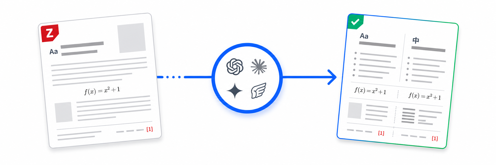
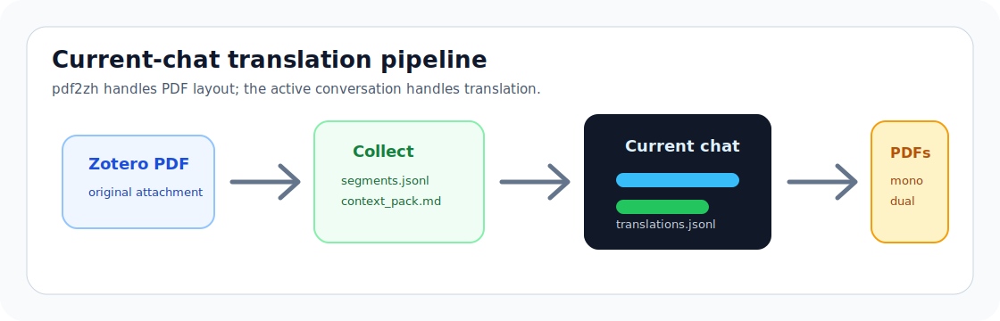
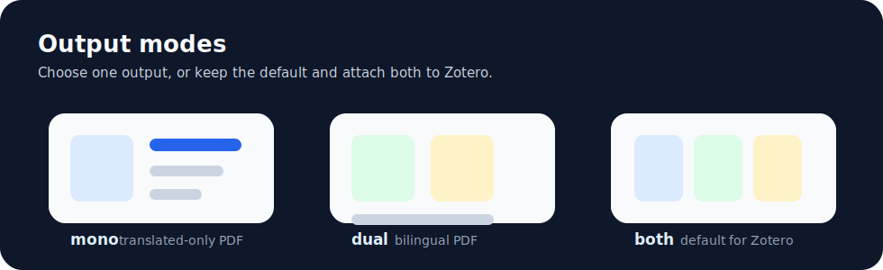

<div align="center">
  
</div>

<div align="center">

# Zotero Translate Skill

[English](../README.md) | 简体中文 | [繁體中文](README_zh-TR.md) | [日本語](README_ja-JP.md) | [한국어](README_ko-KR.md)

[](../LICENSE)


<p>
  <strong>安装一个 skill。翻译论文。保留版式。</strong>
</p>

<p>
  基于 pdf2zh 和 BabelDOC 的 agent-native Zotero PDF 翻译流程。<br>
  需要写回附件时会构建一个最小本地 Zotero bridge。
</p>

[安装](#31-installation) · [快速开始](#32-quick-start) · [CLI 用法](#35-direct-cli-usage) · [技术细节](#4-technical-details) · [故障排查](#47-troubleshooting)

</div>

## 1. 这是什么？

Zotero Translate Skill 面向需要保留 PDF 版式的学术阅读流程。它从 Zotero PDF 附件中收集真实文本片段，在可用时通过已配置的 OpenAI-compatible API 翻译，然后渲染最终 PDF，并把输出附件挂回同一个 Zotero 父条目。

它不是普通的一次性 PDF 翻译提示。这个 skill 会维护确定性的 run manifest，并把容易出错的部分交给 `pdf2zh-next` / BabelDOC：分段、占位符保护、公式和版式处理、最终 PDF 渲染。没有可用 API 时，它会退回到 agent-native 批处理流程，包括术语抽取、批量翻译和渲染前验证，不需要额外的 Zotero 翻译插件。

<p align="center">
  
</p>

### 1.1 功能

| 功能 | 说明 |
| --- | --- |
| API 优先翻译 | 当 prompt 或本地配置提供 `base_url` / `api_port`、`api_key` 和 `model` 时，直接调用 OpenAI-compatible `/v1/chat/completions`。 |
| Agent-native fallback | API 不可用时，当前 agent 会分发 JSONL 翻译批次，并在渲染前验证合并结果。 |
| 自动术语支持 | 构建术语抽取批次，合并 `source,target,tgt_lng` glossary CSV，并把命中的术语注入翻译提示。 |
| 保留版式渲染 | PDF 分段、占位符保护、公式/版式处理和渲染由 `pdf2zh-next` / BabelDOC 完成。 |
| 本地 Zotero bridge | 使用兼容 Zotero 7-9 的最小 XPI 写回附件，并通过 token 保护的本地端点附加 PDF。 |
| 自包含运行时 | 首次运行时在 skill 目录下创建 Python venv 并准备 BabelDOC 资产。 |
| Zotero 原生输出 | 最终 PDF 会附加回原始 Zotero 父条目。 |
| 明确目标语言 | 如果 prompt 没写目标语言，agent 必须先询问。 |
| 默认整篇 PDF | 除非用户指定页码，否则翻译完整 PDF。 |
| 默认 mono + dual | 除非用户指定输出模式，否则同时生成译文 PDF 和双语 PDF。 |
| 仅 Python 脚本 | Python 入口支持 Windows、macOS 和 Linux；不再需要 PowerShell wrapper。 |
| Manifest 清理 | 只有确认 Zotero 附件已写入后才清理临时文件。 |

### 1.2 输出预览

<p align="center">
  
</p>

仓库当前包含生成的 SVG 示意图。为了让 GitHub 首页更直观，可以补充真实工作流截图：

- `assets/preview-zotero-attachments.png`：Zotero 父条目中显示原 PDF、mono 输出和 dual 输出。
- `assets/preview-mono-dual-pages.png`：同一篇论文的 mono / dual 页面并排预览。
- `assets/preview-agent-run.png`：agent 完成 collect、API 或 fallback 翻译、render、attach 的对话截图。

## 2. 最近更新

- **API-first route**：`configure-api` 和 `api-translate` 会在凭据和模型可用时调用 OpenAI-compatible chat completion API。
- **Agent-batch fallback**：API 不可用时，skill 会构建 JSONL 批次并行交给 agent 翻译，默认最多 `16` 个活跃 agent。
- **术语抽取**：术语批次和 `merge_glossary.py` 会生成 BabelDOC 兼容的 `source,target,tgt_lng` glossary CSV，用于提示注入。
- **本地 Zotero bridge**：先在 Zotero Add-ons 中安装一次 release XPI；`ensure_zotero_bridge.py --probe` 导入本地 token，`attach_with_bridge.py` 在 bridge 加载后通过 token 保护的 `health` / `attach` / `verify` 端点写回 PDF。
- **更强验证**：`validate_translations.py` 检查缺失、重复、未知 ID，source/id 不匹配，空目标文本，protected token，rich-text tag 顺序，以及疑似参考文献被翻译的风险。
- **Python-only workflow**：当前维护的入口都是 Python 脚本，不再需要 PowerShell wrapper。

## 3. 使用

<a id="31-installation"></a>

### 3.1 安装

#### 方式 A：Skills CLI

如果你的 agent 环境支持 Skills CLI，可以直接从 GitHub 安装：

```bash
npx skills add https://github.com/Chael-Chael/zotero-translate-skill
```

安装后重启 agent client，让它重新加载可用 skills。

#### 方式 B：Codex 手动安装

macOS / Linux：

```bash
git clone https://github.com/Chael-Chael/zotero-translate-skill.git
mkdir -p "${CODEX_HOME:-$HOME/.codex}/skills"
cp -R zotero-translate-skill/skills/zotero-translate "${CODEX_HOME:-$HOME/.codex}/skills/zotero-translate"
```

Windows PowerShell：

```powershell
git clone https://github.com/Chael-Chael/zotero-translate-skill.git
New-Item -ItemType Directory -Force "$env:USERPROFILE\.codex\skills" | Out-Null
Copy-Item -Recurse -Force ".\zotero-translate-skill\skills\zotero-translate" "$env:USERPROFILE\.codex\skills\zotero-translate"
```

复制后重启 Codex。

这里列出 Codex 路径，是因为 Codex 有常见的本地 skill 目录。工作流本身不是 Codex 专属。

#### 方式 C：其他 Agent

把 [`skills/zotero-translate`](../skills/zotero-translate) 复制到你的 agent 使用的 skill 目录，或让 agent 直接读取 `skills/zotero-translate/SKILL.md`。

确定性流程基于 Python，具有可移植性。兼容 agent 只需要能读取 skill 指令、运行本地 Python 脚本，并通过 connector 或本地自动化访问 Zotero Desktop。skill 会为最终附件写回构建最小 Zotero bridge XPI，并在 Zotero 未加载时明确反馈。

#### Zotero Bridge XPI

首次写回附件前，在 Zotero 中安装一次 bridge：

1. 下载 [`zotero-translate-bridge-0.2.4.xpi`](https://github.com/Chael-Chael/zotero-translate-skill/raw/main/assets/zotero-translate-bridge-0.2.4.xpi)。
2. 在 Zotero 打开 `Tools -> Add-ons`。
3. 点击齿轮，选择 `Install Add-on From File...`，选择该 XPI。
4. 重启 Zotero。
5. 运行一次 probe，让脚本导入本地 bridge token：

```bash
python skills/zotero-translate/scripts/ensure_zotero_bridge.py --probe
```

这个 XPI 不包含共享 token，并按这台机器已安装 Zotero 9 插件的范围风格声明兼容 Zotero `6.999` 到 `10.99.99`。bridge 首次启动会在 Zotero profile 中写入每个用户自己的 `zotero-translate-bridge.json`。

<a id="32-quick-start"></a>

### 3.2 快速开始

打开 Zotero，选择带 PDF 附件的论文条目，然后对 agent 说：

```text
Use $zotero-translate to translate the selected Zotero PDF into Japanese.
```

API 已配置时的默认行为：

1. 将整篇 PDF 收集成稳定文本片段。
2. 通过配置好的 OpenAI-compatible API 翻译片段。
3. 验证翻译 JSONL。
4. 渲染 mono 和 dual 两种 PDF。
5. 将两个 PDF 附加回原 Zotero 父条目。
6. 验证附件。
7. 清理临时 run directory。

没有 API 时的 fallback 行为：

1. 除非禁用 auto glossary，否则构建术语抽取批次。
2. 把 agent 产出的术语结果合并为 `auto_glossary.csv`。
3. 用命中的术语构建翻译批次。
4. 默认最多分发 `16` 个活跃翻译 agent。
5. 验证、渲染、附加、确认并清理。

如果 prompt 没有写目标语言，agent 应该先询问目标语言，再开始 collect phase。

### 3.3 Prompt 示例

| Prompt | 结果 |
| --- | --- |
| `Use $zotero-translate to translate the selected Zotero PDF into Spanish.` | 整篇 PDF，配置 API 时走 API-first route，输出 mono + dual。 |
| `Use $zotero-translate to translate the selected Zotero PDF.` | 先询问目标语言。 |
| `Use API port 8000, key sk-..., model qwen-plus.` | 保存本地 API 配置并优先使用 `api-translate`。 |
| `Use temperature 0.1 and qps 2.` | 在 `api-translate` 阶段传入 API 运行参数。 |
| `Translate only pages 1-3, mono only.` | 传入 `--pages "1-3"` 和 `--output-mode mono`。 |
| `Make a bilingual PDF only.` | 使用 `--output-mode dual`。 |
| `Use 8 parallel agents.` | fallback 批处理路线使用 `--max-parallel-agents 8`。 |
| `No auto glossary.` | fallback 翻译批次前跳过术语抽取。 |
| `Use this glossary CSV: /path/terms.csv.` | 增加一个包含 `source,target,tgt_lng` 列的用户术语表。 |
| `Force agent route.` | 跳过 API 翻译，使用 agent-batch route。 |
| `Translate this paper but keep artifacts for debugging.` | 保留 run directory，跳过清理。 |

### 3.4 要求

| 要求 | 原因 |
| --- | --- |
| Python 3.10+ | 创建 skill-local venv 并运行 helper scripts。 |
| Zotero Desktop | 源 PDF 和最终附件都在 Zotero 中。 |
| 支持 Zotero 的 agent connector | 识别选中的父条目和源 PDF。 |
| 首次运行需要网络 | 安装 `pdf2zh-next`、`PyMuPDF` 和 BabelDOC 资产。 |
| OpenAI-compatible API | 可选但优先；需要 base URL 或端口、API key 和 model。 |
| 可分批执行的 agent | 仅在 API 不可用或被禁用时用于 fallback route。 |

你不需要预装 `pdf2zh`、BabelDOC 或 Zotero 翻译插件。skill 会在自己的目录下准备运行时，并在首次附件写回时构建 bridge XPI。

首次运行会创建：

```text
skills/zotero-translate/.runtime/venv
~/.cache/babeldoc
```

可选 API 配置会存储在：

```text
skills/zotero-translate/.runtime/api_config.json
```

Bridge 构建产物和本地 token 会存储在：

```text
skills/zotero-translate/.runtime/zotero-translate-bridge/
```

这些路径都故意排除在版本控制之外。

<a id="35-direct-cli-usage"></a>

### 3.5 直接 CLI 用法

通常应该通过 agent 使用这个 skill，但确定性 phase 也可以直接执行。

一次性配置 OpenAI-compatible API：

```bash
python skills/zotero-translate/scripts/run_pdf2zh.py \
  --phase configure-api \
  --api-port 8000 \
  --api-key "sk-..." \
  --api-model "model-name"
```

收集片段：

```bash
python skills/zotero-translate/scripts/run_pdf2zh.py \
  --input-pdf "/path/to/paper.pdf" \
  --lang-out "ja"
```

只收集指定页并请求 mono 输出：

```bash
python skills/zotero-translate/scripts/run_pdf2zh.py \
  --input-pdf "/path/to/paper.pdf" \
  --lang-out "ja" \
  --pages "1-3" \
  --output-mode mono
```

通过 API route 翻译：

```bash
python skills/zotero-translate/scripts/run_pdf2zh.py \
  --phase api-translate \
  --run-dir "/tmp/zotero-translate-runs/<run-id>"
```

如果 `api-translate` 返回 `api_unavailable`，运行 fallback batch route：

```bash
python skills/zotero-translate/scripts/run_pdf2zh.py \
  --phase build-glossary-batches \
  --run-dir "/tmp/zotero-translate-runs/<run-id>"

python skills/zotero-translate/scripts/run_pdf2zh.py \
  --phase merge-glossary \
  --run-dir "/tmp/zotero-translate-runs/<run-id>"

python skills/zotero-translate/scripts/run_pdf2zh.py \
  --phase build-batches \
  --run-dir "/tmp/zotero-translate-runs/<run-id>" \
  --max-parallel-agents 16

python skills/zotero-translate/scripts/run_pdf2zh.py \
  --phase validate \
  --run-dir "/tmp/zotero-translate-runs/<run-id>"
```

渲染最终 PDF：

```bash
python skills/zotero-translate/scripts/run_pdf2zh.py \
  --phase render \
  --run-dir "/tmp/zotero-translate-runs/<run-id>"
```

确保 bridge 已安装并写回渲染后的 PDF：

```bash
python skills/zotero-translate/scripts/ensure_zotero_bridge.py --probe

python skills/zotero-translate/scripts/attach_with_bridge.py \
  --run-dir "/tmp/zotero-translate-runs/<run-id>" \
  --parent-item-id "<zotero-parent-item-id>"
```

清理已验证的 run：

```bash
python skills/zotero-translate/scripts/cleanup_artifacts.py \
  --run-dir "/tmp/zotero-translate-runs/<run-id>" \
  --confirm-attached
```

当前维护的入口都在 [`skills/zotero-translate/scripts`](../skills/zotero-translate/scripts) 下，并且都是 Python 脚本。

<a id="4-technical-details"></a>

## 4. 技术细节

### 4.1 翻译路线

优先路线是 API-first：

```text
collect -> api-translate -> validate -> render -> attach -> cleanup
```

collect phase 使用 `collect_segments.py` 作为 `pdf2zh` CLI translator。它把真实源文本写入 `segments.jsonl`，同时返回原文以保证 collect pass 能继续执行。API route 使用 `api_translate_segments.py` 调用 OpenAI-compatible chat-completions endpoint，并写入 `api_results.jsonl`；validation 会把这些结果合并成 `translations.jsonl`。

没有 API、API 不可达，或用户明确跳过 API 时，fallback route 是：

```text
collect -> term batches -> term agents -> merge glossary -> translation batches -> translation agents -> validate -> render -> attach -> cleanup
```

fallback route 使用 `build_term_batches.py`、`merge_glossary.py` 和 `build_batches.py` 准备确定性的 JSONL 工作单元。render phase 始终使用 `lookup_translator.py`，通过稳定 source hash 查找已验证译文。

### 4.2 Run Directory

每次运行都会在系统临时目录下创建一个受管理目录：

```text
zotero-translate-runs/<pdf-stem>-<hash>-<timestamp>/
├── run_manifest.json
├── context_pack.md
├── segments.jsonl
├── translations.jsonl
├── missing_segments.jsonl
├── api_results.jsonl
├── auto_glossary.csv
├── term_batches/
├── glossary_results/
├── batches/
├── batch_results/
├── collect-output/
├── render-output/
└── tmp/
```

run directory 可能包含源文本、译文和术语。除非需要调试，否则成功附加到 Zotero 后应清理。

### 4.3 输出模式

| Output mode | pdf2zh flags | 结果 |
| --- | --- | --- |
| `both` | default | 译文 PDF + 双语 PDF。 |
| `mono` | `--no-dual` | 仅译文 PDF。 |
| `dual` | `--no-mono` | 双语 PDF。 |

### 4.4 运行时选择

`run_pdf2zh.py` 会在需要时创建 `<skill-dir>/.runtime/venv`。

选择顺序：

1. 如果提供了 `--python-exe`，优先使用它。
2. 启动 `run_pdf2zh.py` 的 Python interpreter。
3. 可用时使用 Codex bundled Python runtime。
4. Windows 上依次尝试 `python3`、`python`、`py -3`。

### 4.5 隐私模型

skill 只会把抽取出的 PDF 片段发送到用户或本地配置选择的路线。

重要边界：

- API route：run 使用的 Zotero metadata、PDF 文本片段、术语和 prompt instructions 会发送到配置的 OpenAI-compatible endpoint。
- API credentials 只存储在 `skills/zotero-translate/.runtime/api_config.json`，该路径被 git 忽略；run manifest 不存储明文 API key。
- Agent-batch fallback：PDF 片段和术语会被当前 agent 以及它分发的 batch agents 看到。
- Zotero bridge：Zotero 内只安装 token 保护的本地 `health`、`attach`、`verify` 端点；不暴露任意 JavaScript 执行。
- Context pack 默认会清理常见本地路径字段。
- 临时 run directory 在清理前可能包含源文本和译文。

### 4.6 仓库结构

```text
.
├── README.md
├── LICENSE
├── assets/
│   ├── zotero-translate-hero.png
│   ├── zotero-translate-banner.svg
│   ├── current-chat-pipeline.svg
│   └── output-modes.svg
└── skills/
    └── zotero-translate/
        ├── SKILL.md
        ├── agents/
        ├── assets/
        │   └── zotero-translate-bridge/
        ├── references/
        └── scripts/
            ├── run_pdf2zh.py
            ├── check_api.py
            ├── ensure_zotero_bridge.py
            ├── attach_with_bridge.py
            ├── api_translate_segments.py
            ├── build_batches.py
            ├── build_term_batches.py
            ├── merge_glossary.py
            └── validate_translations.py
```

<a id="47-troubleshooting"></a>

### 4.7 故障排查

| 现象 | 检查项 |
| --- | --- |
| `No usable Python 3 executable was found` | 安装 Python 3.10+ 或传入 `--python-exe /path/to/python`。 |
| 运行时设置很慢 | 首次运行会安装 `pdf2zh-next`、`PyMuPDF`、字体和 BabelDOC 资产。 |
| `api-translate` 返回 `api_unavailable` | 用可达 base URL 或端口、API key、model 运行 `configure-api`；或使用 agent-batch fallback route。 |
| API 输出验证失败 | 降低 temperature，增加更严格的 `--api-extra-instruction`，或把失败片段交给 fallback batches。 |
| Render 报告缺失片段 | 打开 `missing_segments.jsonl`，翻译列出的 id，追加或重新验证，再运行 render。 |
| Zotero 附件失败 | 在 Zotero Add-ons 中安装 release XPI 并重启 Zotero，然后运行 `ensure_zotero_bridge.py --probe`，再用正确的父条目 ID 重试 `attach_with_bridge.py`。 |
| 磁盘占用增长 | 清理已完成的 run directories；保留 `.runtime/venv` 和 `~/.cache/babeldoc` 可加速后续运行。 |

## 5. 项目信息

### 5.1 致谢

这个 skill 基于 [PDFMathTranslate / PDFMathTranslate](https://github.com/PDFMathTranslate/PDFMathTranslate) 及其 `pdf2zh` / BabelDOC 生态中的版式保留 PDF 工作流。README 组织方式参考了 [greensock/gsap-skills](https://github.com/greensock/gsap-skills) 和 [kepano/obsidian-skills](https://github.com/kepano/obsidian-skills) 等公开 skill 仓库。

本仓库与 Zotero、PDFMathTranslate、BabelDOC、Greensock 或 Obsidian 均无隶属关系。

### 5.2 License

AGPL-3.0。详见 [`LICENSE`](../LICENSE)。
