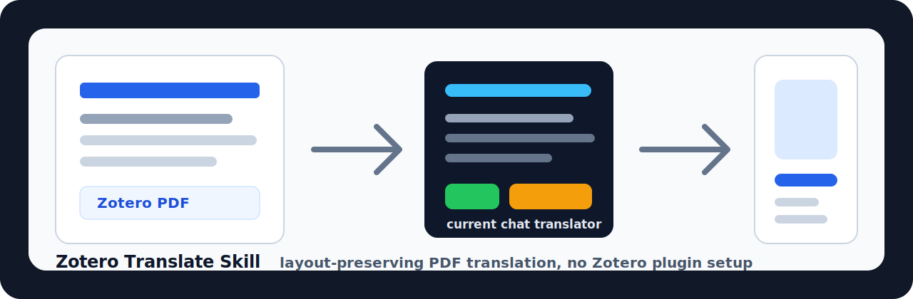
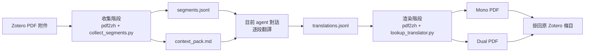
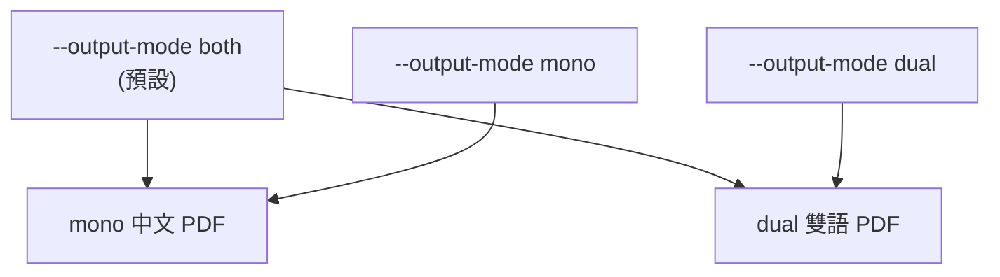

<p align="center">
  
</p>

<p align="center">
  <a href="../LICENSE"></a>
  
  
  
</p>

[English](../README.md) | [简体中文](README_zh-CN.md) | 繁體中文 | [日本語](README_ja-JP.md) | [한국어](README_ko-KR.md)

# Zotero Translate Skill

將 Zotero PDF 附件翻譯成中文，同時盡量保留原 PDF 的版面配置。這個 skill 適用於任何支援本機 skills 的 agent，不限於 Codex。它結合 `pdf2zh` / BabelDOC 的分段與渲染能力，以及 **目前對話翻譯迴圈**：目前 agent 對話負責翻譯抽取出的文字片段，skill 再渲染 mono / dual PDF，並將結果掛回 Zotero。

核心價值是安裝簡單：不需要安裝 Zotero 翻譯外掛，不需要手動設定 PDF 翻譯環境，也不需要預先設定 `pdf2zh` / BabelDOC。安裝 skill 後，它會在首次執行時自舉本機執行環境。

它適合學術論文、技術報告和長 PDF 工作流，尤其適合需要保護公式、引用、佔位符和富文字標籤的場景。

> 這是一個 agent skill 倉庫。可安裝的 skill 位於 [`skills/zotero-translate`](../skills/zotero-translate)。

## 特色

- **只使用目前對話翻譯**：不需要 provider key，不呼叫外部翻譯服務，不啟動背景 LLM 程序。
- **保留 PDF 版面**：分段、公式/版面保護和 PDF 生成交給 `pdf2zh-next` / BabelDOC。
- **無需 Zotero 外掛**：透過 agent 的 Zotero connector 使用 Zotero Desktop，不需要額外安裝 Zotero 翻譯外掛。
- **無需手動設定環境**：skill 首次執行會建立本機 venv 並安裝所需執行環境。
- **Zotero 優先**：從 Zotero PDF 附件收集文字，渲染最終 PDF，並掛回原 Zotero 條目。
- **跨平台腳本**：Python 主入口支援 Windows、macOS、Linux；Windows 使用者仍可使用 PowerShell wrapper。
- **mono、dual 或 both**：預設同時生成中文譯文 PDF 和雙語 PDF。
- **隱私友善的上下文包**：預設不寫入本機路徑和個人儲存細節。
- **基於 manifest 的清理**：只有確認 Zotero 附件已寫回後，才清理臨時執行目錄。

## 運作方式



收集階段使用 CLI translator：它把原文直接返回給 pdf2zh，同時把每個真實分段寫入 `segments.jsonl`。目前對話讀取 `context_pack.md` 和 `segments.jsonl`，寫入 `translations.jsonl`。渲染階段再依穩定 hash 查找譯文並生成最終 PDF。

## 安裝

### 方式 1：使用 Skills CLI

如果你的 agent 環境支援 Skills CLI，可以直接從 GitHub 安裝：

```bash
npx skills add https://github.com/Chael-Chael/zotero-translate-skill
```

安裝後重啟 agent 客戶端，讓它重新載入 skills。

### 方式 2：Codex 手動安裝

複製倉庫，並把 skill 目錄複製到 Codex skills 目錄。

macOS / Linux：

```bash
git clone https://github.com/Chael-Chael/zotero-translate-skill.git
mkdir -p "${CODEX_HOME:-$HOME/.codex}/skills"
cp -R zotero-translate-skill/skills/zotero-translate "${CODEX_HOME:-$HOME/.codex}/skills/zotero-translate"
```

Windows PowerShell：

```powershell
git clone https://github.com/Chael-Chael/zotero-translate-skill.git
New-Item -ItemType Directory -Force "$env:USERPROFILE\.codex\skills" | Out-Null
Copy-Item -Recurse -Force ".\zotero-translate-skill\skills\zotero-translate" "$env:USERPROFILE\.codex\skills\zotero-translate"
```

複製後重啟 Codex。

這裡列出 Codex 是因為它有常見的本機 skill 目錄；workflow 本身並不綁定 Codex。

### 方式 3：其它 agent 手動安裝

把 [`skills/zotero-translate`](../skills/zotero-translate) 複製到你的 agent 使用的 skill 目錄，或讓 agent 指向其中的 `SKILL.md`。確定性工作流腳本以 Python 跨平台實作；但 Zotero 寫回需要你的 agent 具備 Zotero Desktop connector 或等價的本機 Zotero 自動化能力。不需要 Zotero 翻譯外掛。

## 需求

| 需求 | 用途 |
| --- | --- |
| Python 3.10+ | 建立 skill-local venv 並執行 helper scripts。 |
| Zotero Desktop | PDF 來源和最終附件都在 Zotero 中。 |
| 支援 Zotero 的 agent connector | 用於讀取選中條目並寫回最終 PDF。 |
| 首次執行可連網 | 安裝 `pdf2zh-next` 和 `PyMuPDF`。 |
| 足夠的目前對話上下文 | 目前對話需要翻譯 `segments.jsonl`。 |

首次執行會建立：

```text
skills/zotero-translate/.runtime/venv
~/.cache/babeldoc
```

這些目錄已排除於版本控制之外。

你不需要預先安裝 `pdf2zh`、BabelDOC 或 Zotero 翻譯外掛；skill 會在自己的目錄下準備執行環境。

## 快速開始

對你的 agent 說：

```text
Use $zotero-translate to translate the selected Zotero PDF.
```

預設行為：

1. 翻譯整份 PDF。
2. 同時生成 mono 和 dual PDF。
3. 不加入浮水印。
4. 把最終 PDF 附加到同一個 Zotero parent item。
5. 驗證 Zotero 附件後清理中間執行目錄。

## Prompt 控制

| 使用者請求 | skill 行為 |
| --- | --- |
| "translate this Zotero PDF" | 全文翻譯，輸出 mono + dual。 |
| "pages 1-3 only" | 傳遞 `--pages "1-3"`。 |
| "mono only" / "Chinese-only" | 使用 `--output-mode mono`。 |
| "dual only" / "bilingual" | 使用 `--output-mode dual`。 |
| "keep artifacts" | 保留臨時產物用於除錯。 |

## 直接使用 CLI

通常你會透過 agent 呼叫 skill，但確定性階段也可以直接執行。

收集分段：

```bash
python skills/zotero-translate/scripts/run_pdf2zh.py \
  --input-pdf "/path/to/paper.pdf"
```

只收集部分頁面並指定 mono：

```bash
python skills/zotero-translate/scripts/run_pdf2zh.py \
  --input-pdf "/path/to/paper.pdf" \
  --pages "1-3" \
  --output-mode mono
```

目前對話寫好 `translations.jsonl` 後渲染：

```bash
python skills/zotero-translate/scripts/run_pdf2zh.py \
  --phase render \
  --run-dir "/tmp/zotero-translate-runs/<run-id>"
```

確認 Zotero 附件後清理：

```bash
python skills/zotero-translate/scripts/cleanup_artifacts.py \
  --run-dir "/tmp/zotero-translate-runs/<run-id>" \
  --confirm-attached
```

Windows 使用者也可以使用 [`scripts/`](../skills/zotero-translate/scripts) 下的 PowerShell wrapper。

## 執行產物

每次執行會在系統臨時目錄下建立：

```text
zotero-translate-runs/<pdf-stem>-<hash>-<timestamp>/
├── run_manifest.json
├── context_pack.md
├── segments.jsonl
├── translations.jsonl
├── missing_segments.jsonl
├── collect-output/
├── render-output/
└── tmp/
```

確認 Zotero 寫回成功後，可以刪除臨時執行目錄。不要刪除 skill-local `.runtime/venv` 或 BabelDOC cache，除非你希望下次重新安裝執行環境和資源。

## 輸出模式



預設同時輸出兩種 PDF，便於 Zotero 中一次保存，再依閱讀習慣選擇使用。

## 隱私模型

skill 不會把論文送到獨立的翻譯服務。翻譯發生在正在處理你請求的目前 agent 對話中。上下文包預設會移除常見本機路徑欄位，只保留有限的論文元資料和前幾頁文字。

邊界說明：

- Zotero 條目元資料和抽取出的 PDF 分段會進入目前對話。
- skill 不需要 provider-specific translation credentials。
- 清理完成前，本機 run 目錄可能包含原文和譯文。

## 疑難排解

| 現象 | 檢查項 |
| --- | --- |
| `No usable Python 3 executable was found` | 安裝 Python 3.10+，或傳入 `--python-exe /path/to/python`。 |
| 首次執行很慢 | 首次會安裝 `pdf2zh-next`、`PyMuPDF`、字型和 BabelDOC 資源。 |
| render 提示缺失分段 | 打開 `missing_segments.jsonl`，翻譯對應 id，追加到 `translations.jsonl` 後重跑 render。 |
| Zotero 附件失敗 | 確認 Zotero Desktop 已開啟，且 agent 有可用的 Zotero connector。 |
| 磁碟占用成長 | 清理已完成的 run 目錄；保留 `.runtime/venv` 和 `~/.cache/babeldoc` 可加快後續執行。 |

## 倉庫結構

```text
.
├── README.md
├── docs/
├── LICENSE
├── assets/
│   └── zotero-translate-banner.svg
└── skills/
    └── zotero-translate/
        ├── SKILL.md
        ├── agents/
        ├── references/
        └── scripts/
```

## 致謝

這個 skill 受 [PDFMathTranslate / PDFMathTranslate](https://github.com/PDFMathTranslate/PDFMathTranslate) 及其 `pdf2zh` / BabelDOC 生態啟發。README 結構參考了 [greensock/gsap-skills](https://github.com/greensock/gsap-skills) 和 [kepano/obsidian-skills](https://github.com/kepano/obsidian-skills) 等公開 skills 倉庫。

本倉庫與 Zotero、PDFMathTranslate、BabelDOC、Greensock 或 Obsidian 沒有關聯。

## 授權

AGPL-3.0。見 [`LICENSE`](../LICENSE)。
